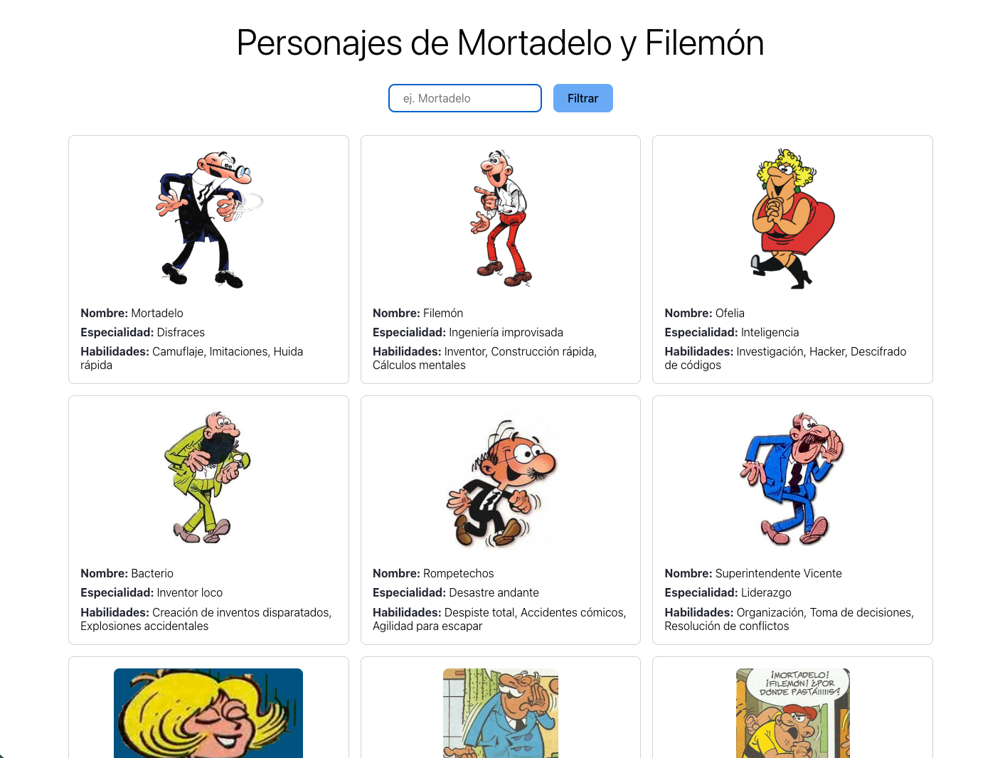
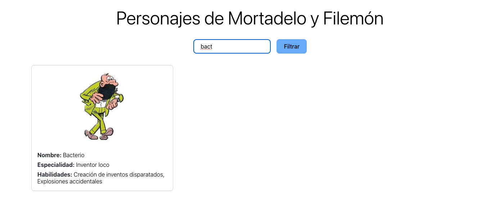
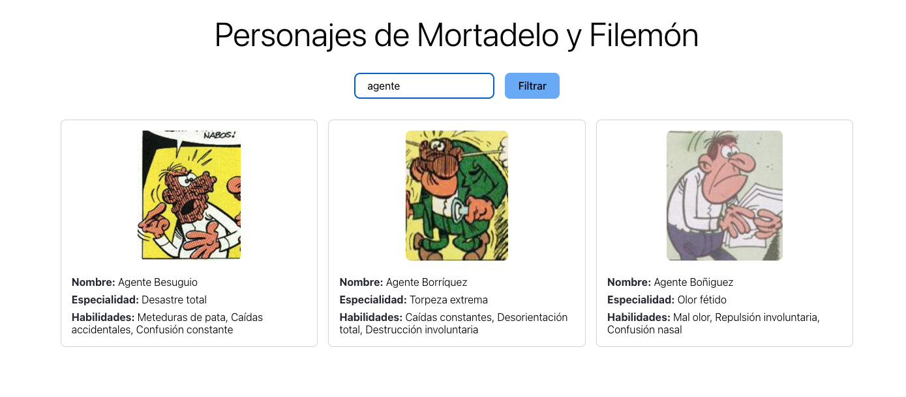

# Módulo 10 - Laboratorio Módulo 10 Asincronía

Para poder visualizar el contenido de este laboratorio.

Pasos:

- Clonate el proyecto.
- Instala las dependencias con `npm install`.
- Ejecuta el sandbox con `npm run dev`.
- Abre el navegador en `http://localhost:5173/` (si ese puerto no te funciona, mira en la consola donde has hecho el build, puede que este ocupado y se haya abierto en otro puerto).

## 1. Clonar repositorio - acceso a los datos

En este proyecto utilizamos los datos de los personajes del cómic de Mortadelo y Filemón que se encuentran en una API. Para usar estos datos clonamos el repositorio y lo ejecutamos.

Podemos ver los datos accediendo a `http://localhost:3000/personajes`

Creamos nuestro proyecto e instalamos axios para poder usarlo.

## 2. Organizar carpetas y archivos

Creamos los archivos que vamos a usar y la carpeta _personajes-listado_ donde incluiremos los archivos que contendrán el código que nos ayudará a darle funcionalidad a la web.

- `index.html` donde montaremos la parte visual, la web. Enlazamos las hojas de css que nos ayudarán a resetear y a dar estilo.
- `reseteo.css` para resetear los estilos. Contamos con una "página en blanco".
- `style.css` con los estilos aplicados en el frontend.
- _personajes-listado_ carpeta donde incluimos todos los archivos con los que nos ayudarán a generar el listado de personajes.
- `personajes-listado.ts` con el paso a paso que nos ayudará a pintar el listado.
- `personajes-listado.model.ts` donde definimos la interface de los datos con los que vamos a trabajar. En este caso los datos que tenemos de nuestros personajes.
- `personajes-listado.api.ts` la función principal que llama a la api para extraer los datos. En este caso usaremos axios.get para acceder a los personajes.

## 3. Visual. HTML y CSS

En primer lugar montamos la estructura de nuestra web, definimos `h1`, el `formulario`con su botón y el espacio donde se cargarán los personajes.
En la hoja de estilos damos color y forma.

## 4. Personajes-listado

Empezamos por extraer los datos de todos los personajes y mostrarlos tal cual en la web. Una vez los tenemos, los estilamos para que se vean bien.

En el archivo `personajes-listado.api.ts` tenemos la función principal que hemos llamado `obtenerPersonajes`que accede a la Api y nos devuelve los personajes.

En `personajes-listado.ts` encontramos el paso a paso para pintar esos personajes obtenidos.

- Como partimos de un espacio en blanco, debemos definir cómo crear el elemento de imagen y los párrafos de las tarjetas de los personajes, para después añadirlos al HTML.
- Pintamos las cards con los personajes y los datos.
- Esperamos a que cargue el DOM para pintar los personajes.

Con esto tendríamos visibles todos los personajes.

Ahora solo nos quedaría poder filtrar el input del formulario:

- Primero "escuchamos" lo que nos dice el formulario. Si hay contenido en el input activamos la funcion `pintarPersonajes`para que nos devuelva su valor.
- Después hacemos que la acción se desencadene cuando activamos el botón ("submit")
- Volvemos a la función de `pintarPersobajes`y le pasamos por parámetros el `inputFormulario`, de manera que le indicamos lo que hay en el formulario para que nos devuelva solo eso => esto lo modificamos también en la api para que funcione correctamente.
- En el archivo `personajes-listado.api.ts` también modificamos la ruta a la que llamamos para extraer los datos por `http://localhost:3000/personajes?nombre_like=${inputFormulario}`

## 5. Funcionamiento

Comprobamos que todo funciona.

